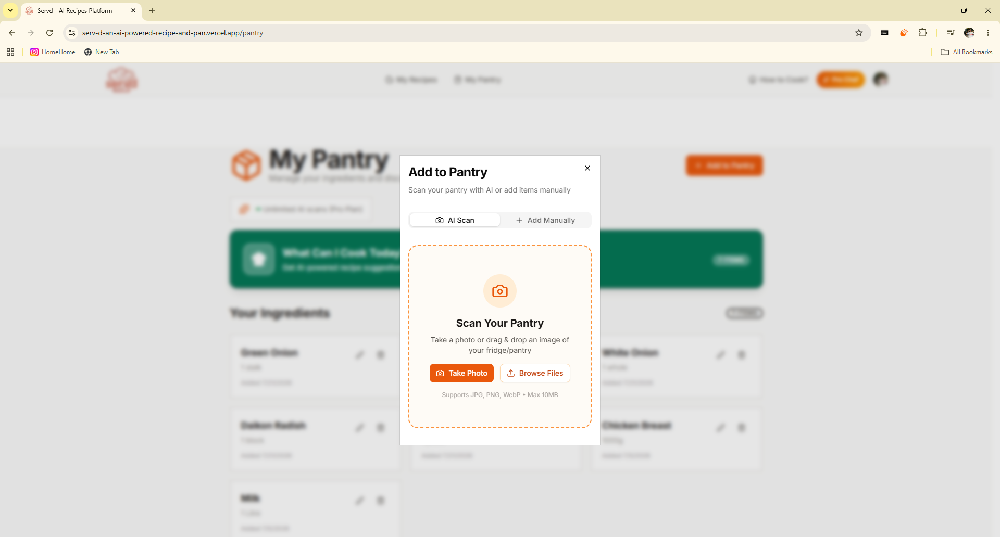
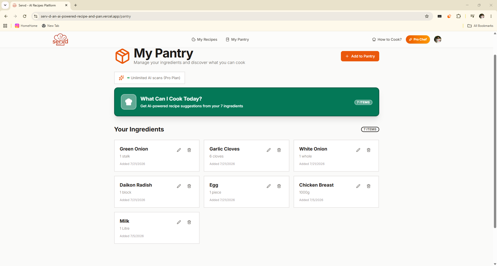
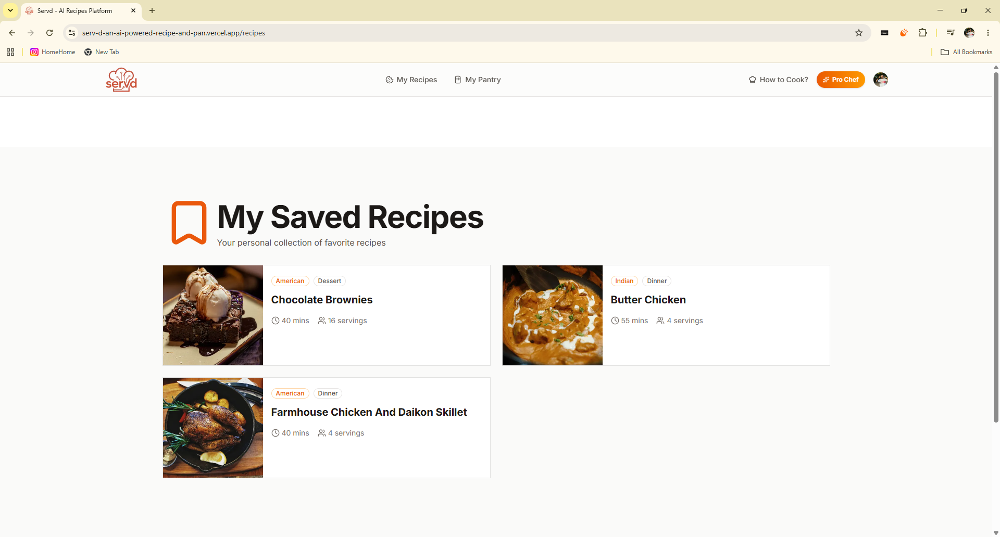
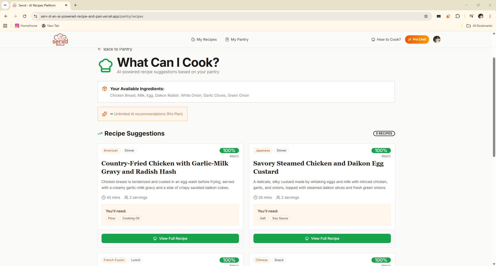
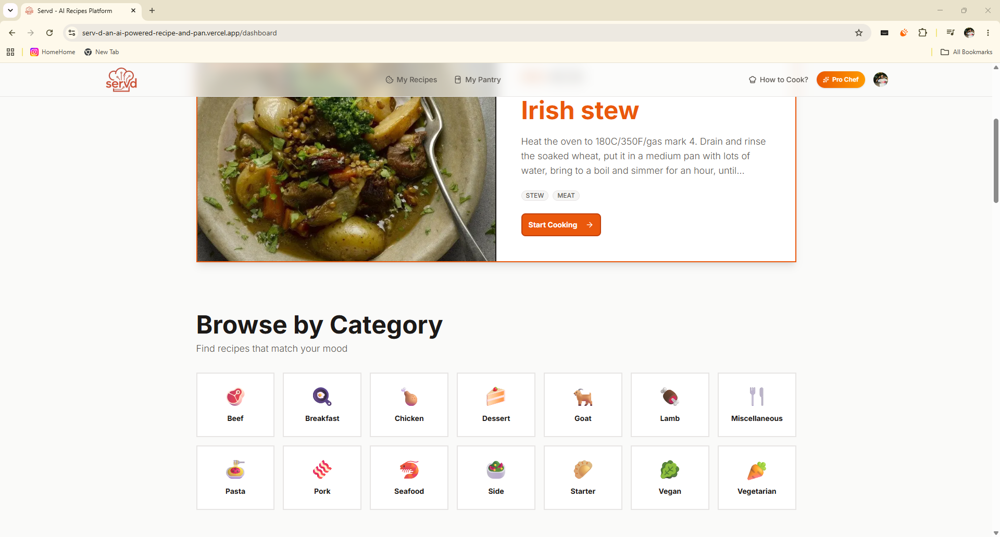
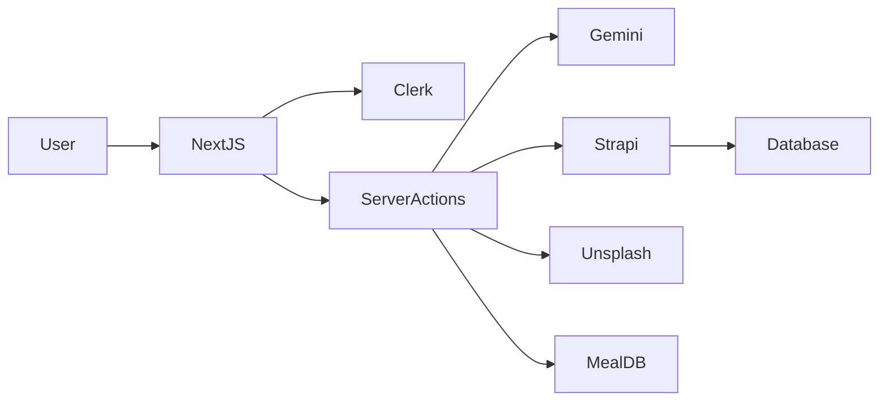

<div align="center">

# 🍳 ServD AI

### AI-Powered Recipe & Pantry Assistant

Turn pantry ingredients into delicious meals using **Google Gemini AI**, manage your digital cookbook, and discover recipes from around the world.

[](https://serv-d-an-ai-powered-recipe-and-pan.vercel.app/)
[](https://github.com/kithusibrian/ServD-An-AI-Powered-Recipe-and-Pantry-Assistant)

<p>


</p>

_A modern AI-powered recipe platform that combines pantry recognition, recipe generation, and intelligent cooking recommendations into one seamless experience._

</div>

---

# 📖 Overview

Servd is a full-stack web application that helps users discover, generate, and manage recipes using Artificial Intelligence.

Instead of searching through hundreds of websites, users can upload a pantry image or search for a meal and let **Google Gemini AI** generate a complete recipe with ingredients, cooking instructions, preparation time, substitutions, serving suggestions, and cooking tips.

The application combines modern frontend development, AI integration, authentication, headless CMS architecture, and third-party APIs to deliver a practical cooking experience.

---

# ✨ Why I Built Servd

Most recipe applications assume you already know what you want to cook.

I wanted to build something different.

Servd focuses on **what you already have** rather than **what you're missing**. By combining computer vision and generative AI, the application helps reduce food waste while making cooking faster and more enjoyable.

This project also gave me the opportunity to work with modern full-stack technologies, AI APIs, authentication systems, and production-ready architecture.

---

# 📸 Screenshots

>

| GeminiAI Scan                 | Pantry                          |
| ----------------------------- | ------------------------------- |
|  |  |

| Recipe                           | AI Generation                 |
| -------------------------------- | ----------------------------- |
|  |  |

| Dashboard                          |
| ---------------------------------- |
|  |

---

# 🚀 Key Features

## 🤖 AI Recipe Generation

Generate complete recipes using Google Gemini AI based on:

- Meal names
- Pantry ingredients
- User preferences
- Available ingredients

Every recipe includes:

- Description
- Ingredients
- Instructions
- Cooking Tips
- Preparation Time
- Cooking Time
- Difficulty
- Servings
- Ingredient Substitutions

---

## 🥗 Pantry Scanner

Upload a pantry image and let AI detect ingredients automatically.

Features include:

- Ingredient Recognition
- Quantity Detection
- Pantry Management
- Smart Recipe Suggestions

---

## 📖 Digital Cookbook

Users can

- Save favourite recipes
- Browse cuisines
- Filter categories
- Search recipes
- Export recipes as PDF

---

## 🔐 Authentication

Authentication is powered by **Clerk** and includes:

- Secure Sign Up
- Login
- Protected Routes
- Session Management

---

## 📱 Responsive Design

Servd is fully responsive across:

- Desktop
- Tablet
- Mobile

---

# 🛠 Tech Stack

| Category       | Technology           |
| -------------- | -------------------- |
| Frontend       | Next.js 16, React 19 |
| Styling        | Tailwind CSS         |
| Backend        | Strapi CMS           |
| AI             | Google Gemini        |
| Authentication | Clerk                |
| Security       | Arcjet               |
| Image API      | Unsplash             |
| Recipe API     | MealDB               |
| PDF Export     | React PDF            |

---

# 🏗 Architecture



---

# 🤖 AI Workflow

```mermaid
flowchart TD

User

↓

Search Recipe

↓

Server Action

↓

Google Gemini

↓

Structured JSON

↓

Store in Strapi

↓

Display Recipe
```

---

# 📂 Project Structure

```text
app/
actions/
components/
hooks/
lib/
public/
backend/
```

---

# ⚙️ Installation

Clone the repository

```bash
git clone GITHUB_REPOSITORY_URL
```

Navigate into the project

```bash
cd servd
```

Install dependencies

```bash
npm install
```

Start development server

```bash
npm run dev
```

---

# 🔑 Environment Variables

Create a `.env.local` file.

```env
NEXT_PUBLIC_CLERK_PUBLISHABLE_KEY=

CLERK_SECRET_KEY=

GEMINI_API_KEY=

STRAPI_URL=

STRAPI_TOKEN=

UNSPLASH_ACCESS_KEY=

ARCJET_KEY=
```

---

# 📦 Production Build

```bash
npm run build

npm start
```

---

# 💡 Skills Demonstrated

This project showcases experience with:

- Full Stack Development
- Next.js App Router
- React
- Tailwind CSS
- Server Actions
- REST APIs
- Google Gemini AI
- Prompt Engineering
- Authentication
- Headless CMS
- PDF Generation
- Responsive Design
- Environment Variables
- Modern JavaScript
- Production Deployment

---

# 🚀 Future Improvements

- Grocery List Generator
- Meal Planner
- Nutrition Tracking
- Voice Assistant
- AI Meal Scheduling
- Shopping List Export
- Multi-language Support
- Recipe Sharing
- Social Features
- Mobile Application

---

# 🤝 Contributing

Contributions are welcome.

1. Fork the repository.

2. Create a feature branch.

3. Commit your changes.

4. Push to your fork.

5. Open a Pull Request.

---

# 📄 License

This project is licensed under the MIT License.

---

# 👨‍💻 Author

## Brian Kithusi

Computer Science Graduate

Full Stack Developer

AI Enthusiast

🌐 Portfolio: **https://personal-portfolio-five-livid-75.vercel.app/**

💼 LinkedIn: **http://www.linkedin.com/in/briankithusi**

📧 Email: **briaokm@gmail.com**

---

<div align="center">

### ⭐ If you found this project interesting, consider giving it a star!

**Built with ❤️ using Next.js, React, Strapi and Google Gemini AI**

</div>
